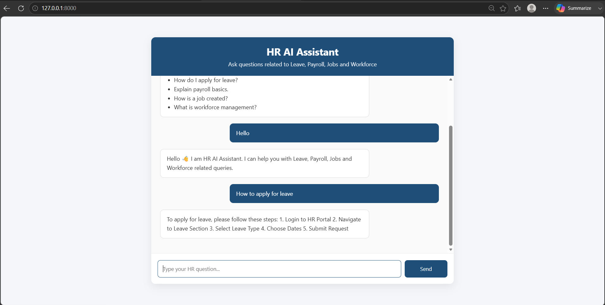
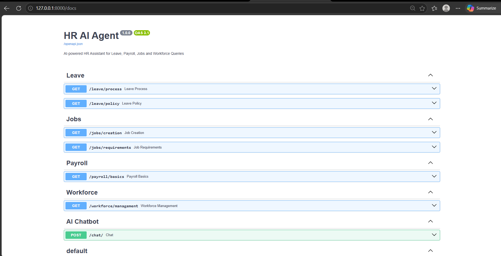

# HR AI Agent 🤖

## Overview

HR AI Agent is an AI powered chatbot that helps employees get answers related to HR processes like:

- Leave Management
- Payroll
- Job Creation
- Workforce Management

## Features

- AI powered HR chatbot
- Gemini API integration
- Knowledge base driven responses
- Intent detection
- REST API backend
- Responsive frontend UI

## Tech Stack

Backend:
- Python
- FastAPI
- Gemini AI
- Pydantic

Frontend:
- HTML
- CSS
- JavaScript

Tools:
- Git
- GitHub

## Architecture

User
 |
Frontend Chat UI
 |
FastAPI API
 |
Intent Detector
 |
Knowledge Base
 |
Gemini AI
 |
Response

## Setup

Clone repository

## git clone repo-url

## Create virtual environment

- python -m venv venv
- venv\Scripts\activate
- pip install -r requirements.txt
- uvicorn app.main:app --reload 

## Screenshots
### Chatbot UI

### API Documentation

AI Usage

Gemini AI was used for:

Natural language understanding
Generating HR responses
Context based answers using knowledge files

Knowledge files:

leave.json
jobs.json
payroll.json
workforce.json
Challenges
Designing intent detection
Integrating Gemini API
Connecting frontend with backend
Maintaining structured knowledge base
Future Improvements
Authentication
Employee database
Leave application workflow
Notifications
Admin dashboard
